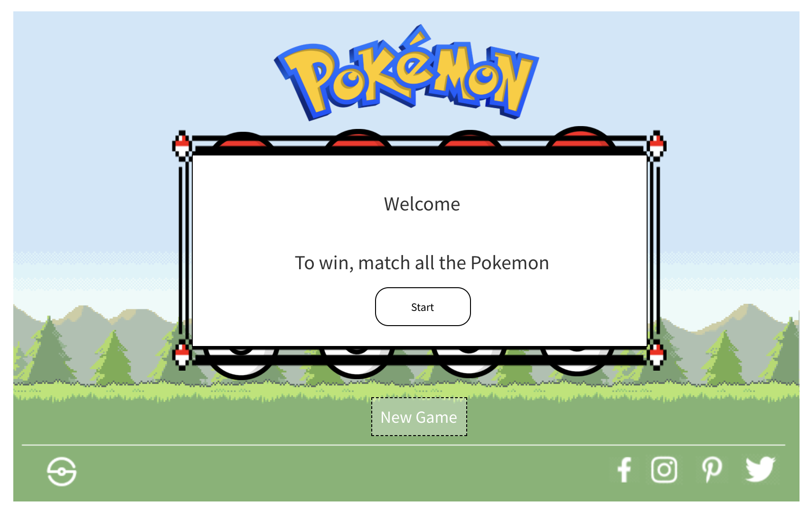
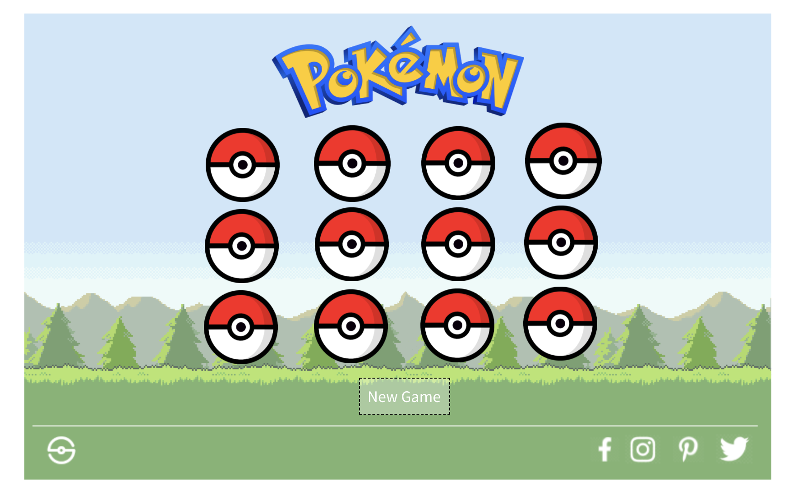
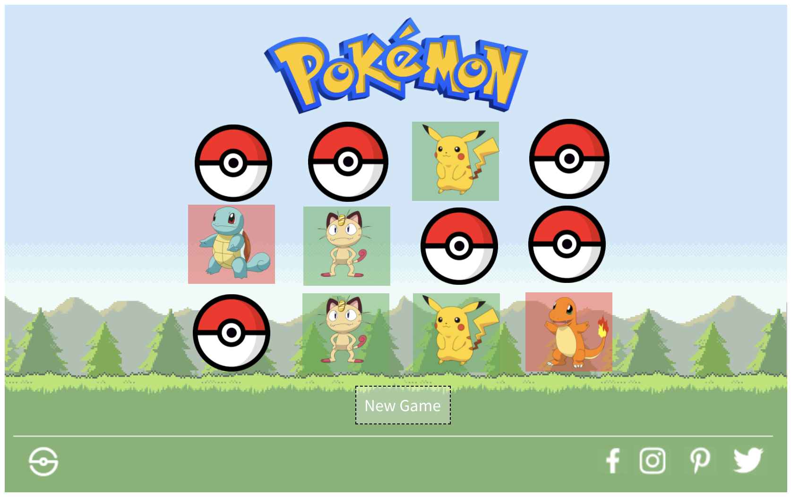
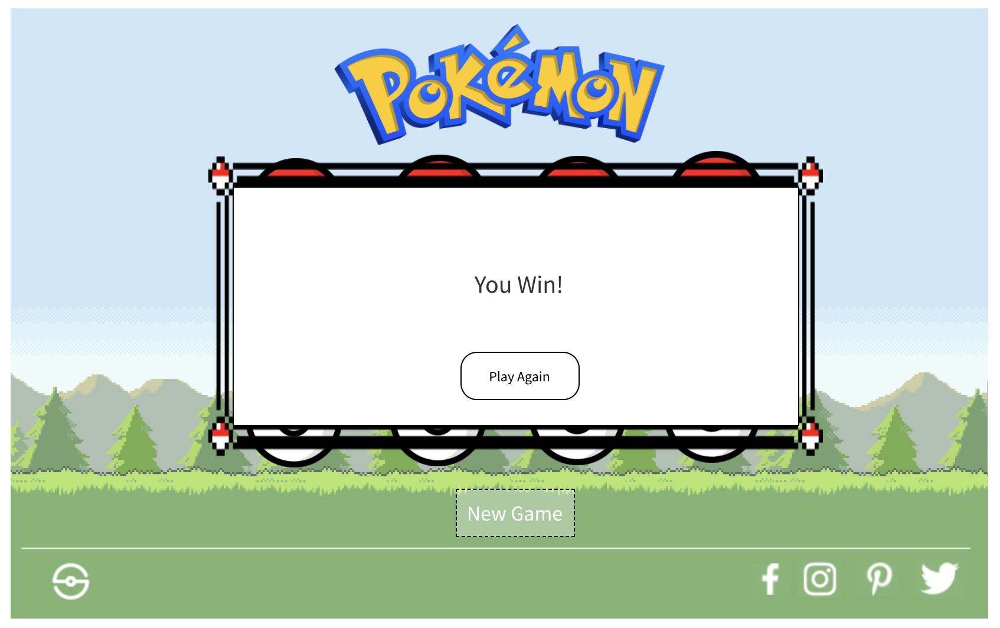
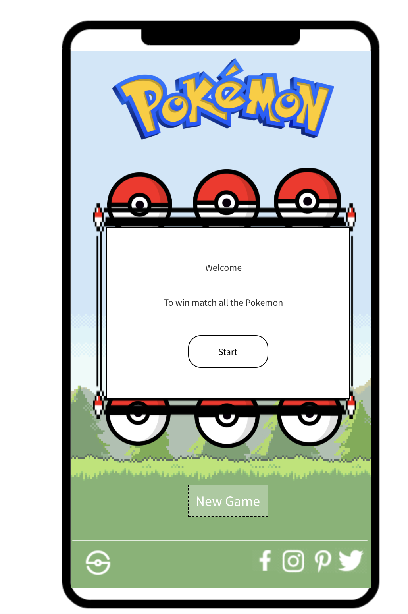
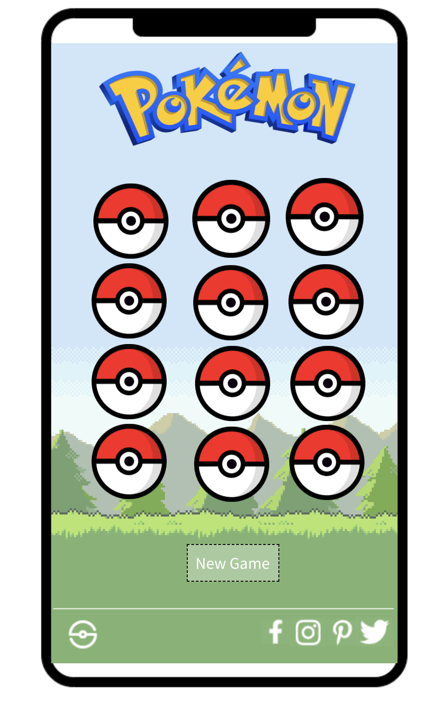
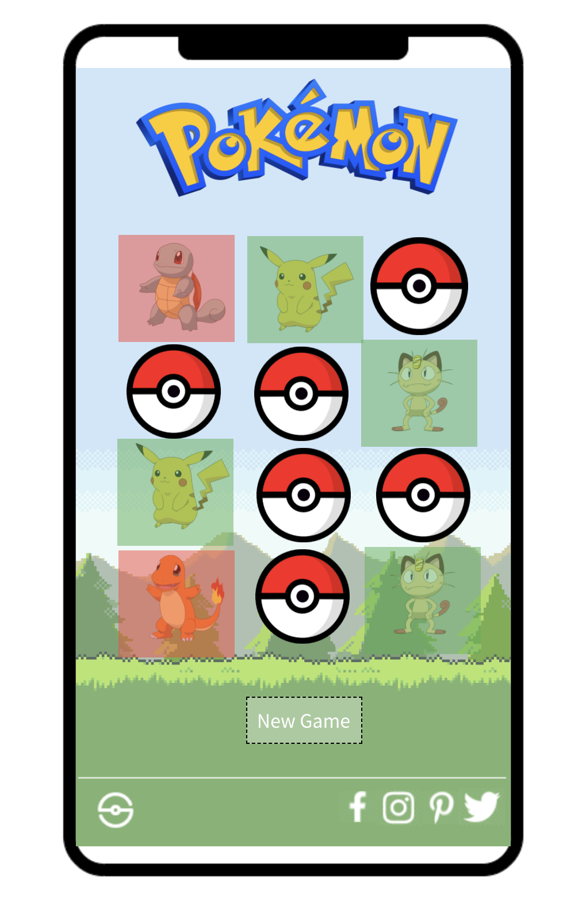
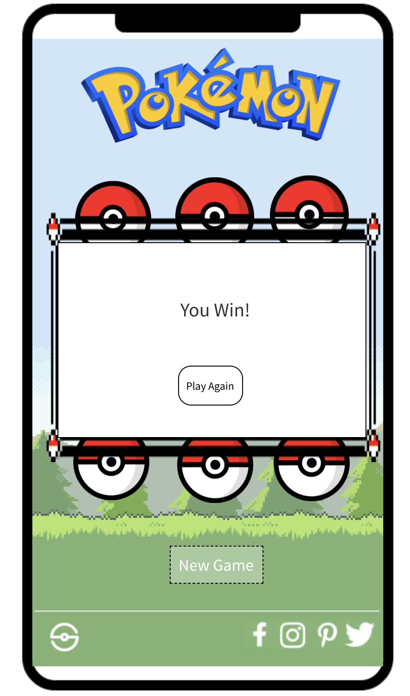

<h1 align="center">Pokemon Memory Game</h1>

[View the live project here.](https://tommahawk65.github.io/Game-1/)

## UX

### Project Goals

#### External user’s goal:
The site users goal is to flip individual Pokemon cards over to reveal each Pokemon behind it. Using memory the user must try and locate all the matching
pairs of Pokemon to win the game.

#### Site owner's goal:
The site owners goal is to create an interesting and engaging game with a Pokemon Theme.
 
### Design
I chose to use Pokemon as I felt that its a very popular brand with recognisable characters. The game is quite simple and will therefore likely be more appealing to younger audiences, this also makes the Pokemon theme appropriate as it is a kids tv show.

The theme provides a good design language that is already established and recognised by a large audience.  My goal was to keep my design inline with the already established theme.

#### Colour Scheme
-   The main colours are Red, Green and Yellow. This matches with the already established colour scheme of Pokemon.
#### Typography
-   I used Castoro font as the main font used fort the whole website with Sans Serif as the fallback font in case for any reason the font isn't being imported into the site correctly. I initially tried an 8 bit style font, however I opted for an easier to read alternative.
#### Imagery
-   All of the images and logos are sourced from the original IP, I was able to find everything I needed by searching online for assets which allowed the game to keep the authentic look of Pokemon.

### Wireframes Full View

#### Instruction View



#### Game Start


#### Flipping Cards


#### Win Message


### Wireframes Mobile View

#### Instruction View



#### Game Start


#### Flipping Cards


#### Win Message"


## Features 

### Existing Features

__Instruction &  Win Pop Up__ 

  - These windows give information to the user at the beginning and the end of the game. This allows them to read the instructions at the beginning and receive confirmation they have completed the game at the end.

- __New Game & Reset__ 

  - Allows the user to start a new game if they get stuck or replay the game once they have won and received the win message.

  __Social Media Footer__ 

  - The footer section includes links to the relevant social media sites for Pokemon (currently left as the default sites). The links will open to a new tab to allow easy navigation for the user. 

  - The footer is valuable to as it can link the user to other brand related webistes for marketing purposes.

  __Responsive On All Device Sizes__ 

  - I made sure to make this game fully responsive on all devices to allow as much access as possible. This game is well suited to mobile use and due to the younger target audience will likely be used mostly on mobile devices.

  __Sound FX__ 

  - Backround music and sound effects on matching/not matching are all sourced from the original Pokemon games.  This makes this game even more in line with the IP and may give some nostalgia to older audiences who have played the old games.


### Possible Features to Add

- __Score Counter__ 

  - Adding a score counter which kept track of how many turns it took to win would add extra value to the game. it could be shown at the end along with the win message.

  __High Score Leader Board__ 

  - Allowing users to display their high score and also view other players score would increase competition and add an extra element of interest to the game.

  - This would require backend technologies that are beyond the scope of this project.

  __Higher Difficulty__ 

  - Either having a difficulty selector or increasing the difficulty after each win message would greatly increase replayablity. This could be achived by adding more cards on each new round, as this is a memory game it would become much harder for the user.

### Languages Used

-   [HTML5](https://en.wikipedia.org/wiki/HTML5)
-   [CSS3](https://en.wikipedia.org/wiki/Cascading_Style_Sheets)
-   [Javascript](https://en.wikipedia.org/wiki/JavaScript)


### Frameworks, Libraries & Programs Used

1. [Hover.css:](https://ianlunn.github.io/Hover/)
    - Hover.css was used on the Social Media icons in the footer and New Game button to add the float transition while being hovered over.
1. [Google Fonts:](https://fonts.google.com/)
    - Google fonts were used to import the 'Titillium Web' font into the style.css file which is used on all pages throughout the project.
1. [Font Awesome:](https://fontawesome.com/)
    - Font Awesome was used on all pages throughout the website to add icons for aesthetic and UX purposes.
1. [GitHub:](https://github.com/)
    - GitHub is used to store the projects code after being pushed from Git.
1. [Wirefrramepro:](https://wireframepro.mockflow.com/)
    - Wirefrramepro was used to create the wireframes during the design process.

## Testing 

- I have tested all elements of this website to ensure all the features work correctly.

- I have spent a lot of time making sure this website is fully responsive on a number of devices.

### Bugs

- Game may crash if user clicks on elements multiple times very quickly.

### Validator Testing 

- HTML
  - No errors were returned when passing through the official [W3C validator]
- CSS
  - No errors were found when passing through the official [(Jigsaw) validator]
- Javascript
  - No errors were found when passing through the [(Jshint) validator]

## Deployment

The live link can be found here - https://tommahawk65.github.io/Game-1/

### GitHub Pages

The project was deployed to GitHub Pages using the following steps...

1. Log in to GitHub and locate the [GitHub Repository](https://github.com/)
2. At the top of the Repository (not top of page), locate the "Settings" Button on the menu.
    - Alternatively Click [Here](https://raw.githubusercontent.com/) for a GIF demonstrating the process starting from Step 2.
3. Scroll down the Settings page until you locate the "GitHub Pages" Section.
4. Under "Source", click the dropdown called "None" and select "Master Branch".
5. The page will automatically refresh.
6. Scroll back down through the page to locate the now published site [link](https://github.com) in the "GitHub Pages" section.

### Forking the GitHub Repository

By forking the GitHub Repository we make a copy of the original repository on our GitHub account to view and/or make changes without affecting the original repository by using the following steps...

1. Log in to GitHub and locate the [GitHub Repository](https://github.com/)
2. At the top of the Repository (not top of page) just above the "Settings" Button on the menu, locate the "Fork" Button.
3. You should now have a copy of the original repository in your GitHub account.

### Making a Local Clone

1. Log in to GitHub and locate the [GitHub Repository](https://github.com/)
2. Under the repository name, click "Clone or download".
3. To clone the repository using HTTPS, under "Clone with HTTPS", copy the link.
4. Open Git Bash
5. Change the current working directory to the location where you want the cloned directory to be made.
6. Type `git clone`, and then paste the URL you copied in Step 3.

```
$ git clone https://github.com/YOUR-USERNAME/YOUR-REPOSITORY
```

7. Press Enter. Your local clone will be created.

```
$ git clone https://github.com/YOUR-USERNAME/YOUR-REPOSITORY
> Cloning into `CI-Clone`...
> remote: Counting objects: 10, done.
> remote: Compressing objects: 100% (8/8), done.
> remove: Total 10 (delta 1), reused 10 (delta 1)
> Unpacking objects: 100% (10/10), done.
```

Click [Here](https://help.github.com/en/github/creating-cloning-and-archiving-repositories/cloning-a-repository#cloning-a-repository-to-github-desktop) to retrieve pictures for some of the buttons and more detailed explanations of the above process.

## Credits 

- All media used in this project the propery of Nintendo/Creatures Inc./GAME FREAK inc. The site is for educational purposes only.
- The icons in the footer were taken from [Font Awesome](https://fontawesome.com/)
- Basic javascript game programming walkthroughs from (https://www.freecodecamp.org/)

### Media

- All character icons, The main header and unrotated card icons are from (https://www.pngwing.com/)
- Main backround image is from (https://imgur.com/gallery/SELjK)
- All audio is from (https://downloads.khinsider.com/game-soundtracks/album/pokemon-ruby-sapphire-music-super-complete)

### Acknowledgements

-   My Lecturer for helpful feedback.

-   Tutor support at Code Institute for their support.
